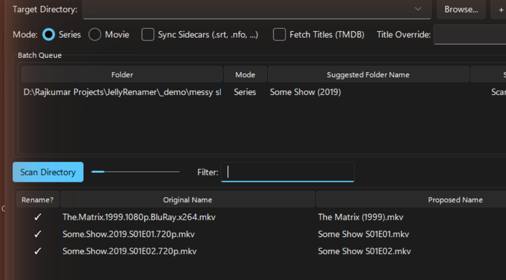

<p align="center">
  
</p>

<h1 align="center">MediaStager</h1>

<p align="center">
  Batch-rename TV episodes and movies into filenames <em>and folders</em> that Jellyfin and Plex actually recognize.
</p>

<p align="center">
  <a href="https://github.com/The-ViRkumar/MediaStager/actions/workflows/release.yml"></a>
  <a href="https://github.com/The-ViRkumar/MediaStager/releases"></a>
  
  <a href="LICENSE"></a>
</p>

<p align="center">
  
</p>

Point it at a messy folder — or several at once — and it proposes correct
`Show Name S01E02.ext` / `Movie Name (Year).ext` filenames and correct
folder names, using [`guessit`](https://github.com/guessit-io/guessit) for
parsing instead of brittle regex. Review everything in one table, execute,
and undo it with one click if anything's wrong — folder renames included.

Rebuilt from the ground up, inspired by
[BeckH26/Jellyfin-Renamer](https://github.com/BeckH26/Jellyfin-Renamer).

## Contents

- [Features](#features)
- [Jellyfin naming reference](#jellyfin-naming-reference)
- [Download](#download)
- [Run from source](#run-from-source)
- [How to use it](#how-to-use-it)
- [Building your own executable](#building-your-own-executable)
- [Project layout](#project-layout)
- [Author](#author)
- [License](#license)

## Features

**Smart, format-aware renaming**
- **Series or Movie mode**, chosen per folder — `guessit` is hinted to the
  right type instead of guessing blind.
- **Jellyfin folder-name suggestions** for every folder you process
  (`Show Name (Year)` / `Movie Name (Year)`) — double-click to copy, or let
  Execute Rename apply it for you.
- **TMDB enrichment** — real episode titles in Series mode, canonical
  title/year correction in Movie mode. Falls back cleanly if the lookup
  fails or is off.
- **Sidecar sync** — subtitles (including language tags like `.en.srt`) and
  `.nfo` files are renamed right alongside their video.

**Built for real libraries, not one file at a time**
- **Batch queue across multiple folders** — queue as many folders as you
  want, each keeping its own mode and options, scan them all, review one
  table, execute once.
- **Editable preview** — fix any proposed name by hand, exclude rows you
  don't want touched.
- **Title override** for folders too messy for automatic detection.
- **UNC / network share support** — paste a `\\Server\Share\...` path
  directly; no dependence on the OS folder picker mapping the drive.

**Safety first**
- **Undo Last Batch** reverses an entire batch — every renamed file *and*
  any folder rename — across every queued folder at once.
- **Never overwrites** — a collision is skipped and reported, never
  clobbered.
- The TMDB API key lives in memory for the session only; it's never written
  to disk.

## Jellyfin naming reference

This is exactly what MediaStager produces:

| | Folder | File |
|---|---|---|
| **Series** | `Show Name (2019)/Season 01/` | `Show Name S01E02.mkv` |
| **Movie** | `Movie Name (2008)/` | `Movie Name (2008).mkv` |

## Download

Grab a ready-to-run build from the
[**Releases**](https://github.com/The-ViRkumar/MediaStager/releases) page —
`MediaStager-<version>-windows.exe`, `-macos`, or `-linux`. No Python
required; just download and run.

## Run from source

```bash
pip install -r requirements.txt
python main.py
```

Requires Python 3.9+.

## How to use it

1. Pick **Series** or **Movie** mode, paste or browse to a folder, and click
   **+ Add to Queue** (repeat for every folder you're processing — mixing
   series and movie folders in the same batch is fine).
2. Toggle **Sync Sidecars** / **Fetch Titles (TMDB)** as needed before adding
   each folder — they're captured per folder. The first time you enable
   TMDB you'll be asked for a free API key from
   [themoviedb.org](https://www.themoviedb.org/settings/api).
3. Click **Scan Directory** — it scans everything queued and fills the table
   with every proposed name from every folder.
4. Fix anything by hand (double-click a proposed name), exclude rows you
   don't want touched, and check **Also rename folders** if you want the
   queued folders renamed to their suggested Jellyfin names too.
5. Click **Execute Rename**.
6. Made a mistake? **Undo Last Batch** reverses every queued folder's last
   batch — files and any folder rename — in one click.

## Building your own executable

Push a version tag and CI builds all three platforms and publishes them to
Releases automatically:

```bash
git tag v1.1.0
git push origin v1.1.0
```

`.github/workflows/release.yml` builds `MediaStager-v1.1.0-windows.exe`,
`-macos`, and `-linux` in parallel via PyInstaller and attaches them to a
GitHub Release. Repeat with the next version number whenever you're ready
to ship.

To build one locally instead (on the matching OS):

```bash
pip install pyinstaller
COLLECT="--collect-all guessit --collect-all babelfish --collect-all sv_ttk"
pyinstaller --noconsole --onefile --name MediaStager --icon assets/icon.ico $COLLECT --add-data "assets;assets" main.py   # Windows
pyinstaller --noconsole --onefile --name MediaStager --icon assets/icon.icns $COLLECT --add-data "assets:assets" main.py  # macOS
pyinstaller --noconsole --onefile --name MediaStager $COLLECT --add-data "assets:assets" main.py                          # Linux
```

## Project layout

| File | Purpose |
|---|---|
| `core.py` | Parsing, sidecar matching, TMDB lookup, ledger — no GUI imports. |
| `gui.py` | Tkinter/ttk application window. |
| `main.py` | Entry point. |
| `assets/generate_icon.py` | Regenerates the app icon (dev-time only). |
| `.github/workflows/release.yml` | Builds and publishes tagged multi-platform releases. |

## Author

Built by [**The.ViRkumar**](https://github.com/The-ViRkumar).

## License

MIT — see [LICENSE](LICENSE).
